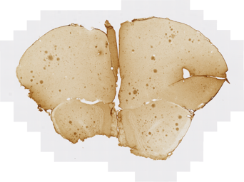
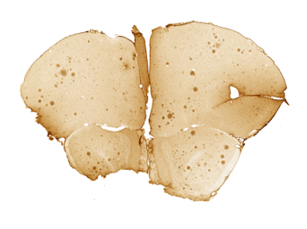

# tiffManipulation
A set of Matlab functions to manipulate high resolution microscopic images. It focuses mainly on manipulating Tiff images.

## Resizing images
Function name: **tiffResizeProd.m**
### High level description:
Change the size of an image (tiff or other)   

This function will change the size (column and row) of inputIm. The size of the new image will be harvested from the refIm or, if refIm is left empty, from the Option imSize. Output name is generated automatically adding the suffix `_resize` if outputIm is left empty.

### Required input arguments:
- input  : string. It can be an image file name or a folder , or a directory containing exclusively directories
- output : string. It can be an empty string ('') to write in the same folder as input, an image file name or a folder

### Optional input arguments:
- imSize: scalar or 2x1 vector
    * if scalar then the image x and y number of pixels will be modified to newX = imSize * X and newY = imSize * Y
    * if vector then the image will be resized to the size [imSize(1) imSize(2)]. If one enters NaN as one of the two value of the vector, the algorithm will rescale the non NaN to the desired size and resize the other while keeping the proportion of the image

- interp: string. The type of interpolation to use. Possible choices :
               {'nearest','bilinear','bicubic','box','lanczos2','lanczos3'}

- refIm: string (filename). The size of the the resized image can be copied directly from a reference image defined with this option (default: '')
- suffix: string. The suffix that is added at the end of the filename
- outfmt  : string. Any image format for output (default: same as input)
- istiled : boolean. if true, the tif output will be tiled (default: false)
- export_json : boolean. if true, will export a json file containing the image size of the inut and output files (default: false)

### Examples:
- Resize the image called Mtg01_bl1_4G8_s078.tif to have a width (column) of 1024 pixels:
```matlab
>> tiffResizeProd('Mtg01_bl1_4G8_s078.tif','Mtg01_bl1_4G8_s078.png','imSize',[NaN 1024])
```
- Reduce by a factor 2 all the images in folder Z:\\Matlab_scripts\\test_data\\ and place them in the folder Z:\\Matlab_scripts\\test_data_half_size\\:
```matlab
>> tiffResizeProd('Z:\\Matlab_scripts\\test_data\\','Z:\\Matlab_scripts\\test_data_half_size\\','imSize',0.5)
```
- Reduce all the tiff images in folder Z:\\Matlab_scripts\\test_data\\, to have a width (column) of 1024 pixels, change format to png, keeping the same image name and place them in the folder Z:\\Matlab_scripts\\test_data_half_size\\:
```matlab
>> tiffResizeProd('Z:\\Matlab_scripts\\test_data\\',...
'Z:\\Matlab_scripts\\test_data_half_size\\',...
'imSize',[NaN 1024],'outfmt','png','suffix','');
```

## Removing tiles from the border of the microscopic section
## Resizing images
Function name: **tiffAdjProd.m**
### High level description:
Remove the grey tiles surrounding a microscopic section image (tiff or other)
  


### Required input arguments:
- input: string. Can be a tiff filename with or without extension, or a directory name, or a directory containing exclusively directories
- output_dir: string. Location where the adjusted tiff will be stored

### Optional input arguments:
- sat_pix: number (0<sat_pix<1). Percentage of pixels we accept to saturate in the black part of the image (default: 0.05)
- make_thumb: boolean. save a thumbnail version of the input and  processed image (default: false)
- make_mask: boolean. save the binary image of the input mask (default: false)
- whole_section: boolean. If true, applies the contrast adjustment to the whole section. If false, only applies it to the outside of the mask (default: true)
- suffix: string. The suffix that is added at the end of the filename (default: '\_adj')

### Examples:
- Remove tiles of 'tg2576_m287_1D1_IV-1_s1.tif' and accept that 0.1% are saturated in the black part of the image and write it in the same folder as `tg2576_m287_1D1_IV-1_s1_adj.tif`

```matlab
>> tiffAdjProd('tg2576_m287_1D1_IV-1_s1.tif','','sat_pix',0.1);
```

- Remove tiles of all tiff files in folder `Z:\Matlab_scripts\test_data\` and write the adjusted files in `Z:\Matlab_scripts\test_data_adjusted\` with same filename

```matlab
>> tiffAdjProd('Z:\Matlab_scripts\test_data\','Z:\Matlab_scripts\test_data_adjusted\','suffix','');
```

## Renaming and rotating images
## Resizing images
Function name: **tiffRenameResizeProd.m**
### High level description:
Rename and/or rotate images. This function reads the list of the input files in an Excel file and rename and/or rotate these files. Rotation properties can be defined individually per file. The output filename is also read in the Excel file.

### Required input arguments:
- input_dir: string. The directory containing the input images listed in the Excel file. The program will work with any image format(tif, png, jpg, etc...).
- output_dir: string. Location where the renamed and/rotated images will be stored. The output images have the same format as the input images.
- xls_fn: Excel file capturing the user input. The format of this file is important and can be found in `TE_001_RenamingTemplate.xlsx`

### Optional input arguments:
- serie_dsc: the name of the tab in the Excel file
- col_src_txt: the header of the column containing the original section names (default: 'Scanning name')
- col_tgt_txt: the header of the column containing the target section names (default:'Renamed before Navigator')
- col_rot_txt: the header of the column containing the rotation information (default:'Rotation'). This column can contain four different entries:
  - a number which captures the angle we want to rotate counterclock wise the image (angle in degrees)
  - a string: 'FH' or 'FV': flip horizontally or flip vertically
  - empty or 0: do nothing

### Examples:

- Rotate all the images in folder Z:\Matlab_scripts\test_data\ with an angle defined in the Column 'Rotate' of the sheet '4G8' of the Excel file called `Z:\Matlab_scripts\test_data\TE_001_RenamingTemplate.xlsx`. Then the images are renamed using the information in the column 'Renamed before Navigator'.
```matlab
>> tiffRenameRotateProd('Z:\Matlab_scripts\test_data\',...
    'Z:\Matlab_scripts\test_data\',...       
    'Z:\Matlab_scripts\test_data\TE_001_RenamingTemplate.xlsx',...
    'serie_dsc','4G8');
```


## Creating tiles from a single image
